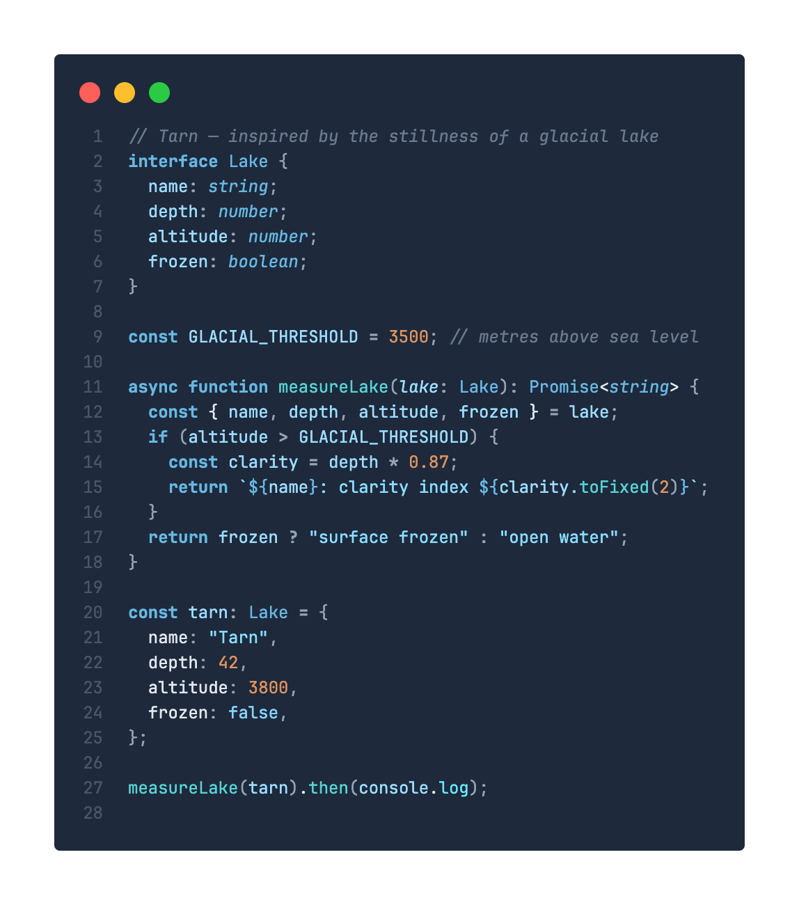
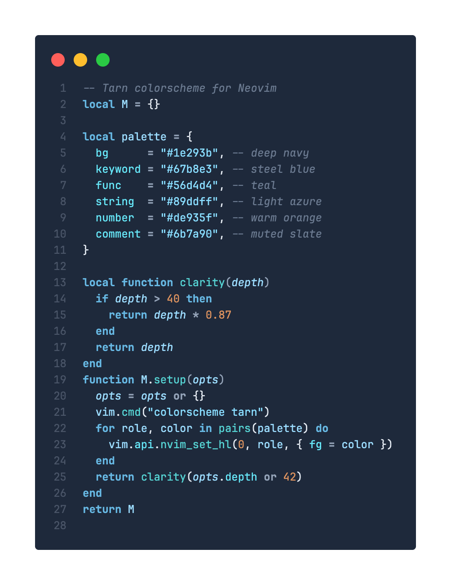
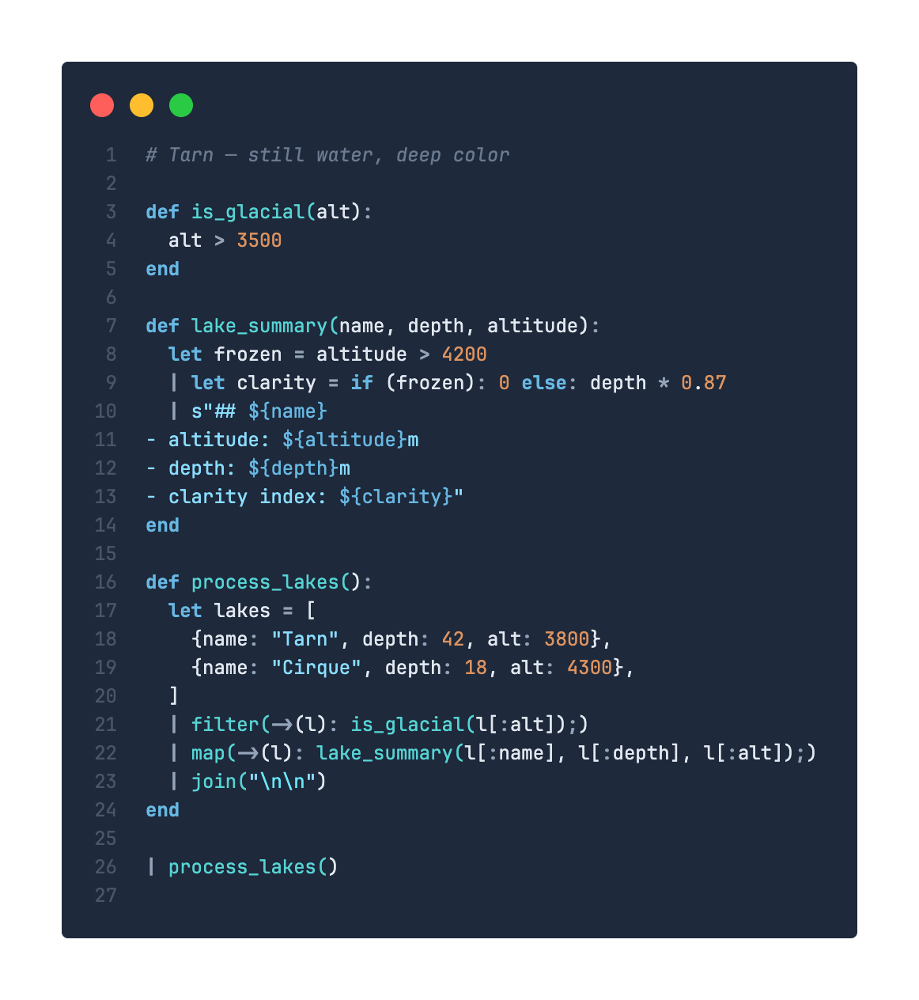

<div align="center">
  
  <h1>Tarn</h1>
  <p>A dark color theme inspired by the stillness of a high-altitude glacial lake: deep navy depths, steel blue shimmers, and teal-to-azure light across the surface.</p>
</div>

<div align="center">
  
  
  
</div>

Also used in the [mq playground](https://mqlang.org/playground).

## Color Palette

| Role       | Color     |             |
| ---------- | --------- | ----------- |
| Background | `#1e293b` | Deep navy   |
| Keywords   | `#67b8e3` | Steel blue  |
| Functions  | `#56d4d4` | Teal        |
| Strings    | `#89ddff` | Light azure |
| Numbers    | `#de935f` | Warm orange |
| Variables  | `#9cdcfe` | Sky blue    |
| Properties | `#67e8f9` | Bright teal |
| Comments   | `#6b7a90` | Muted slate |
| Operators  | `#94a3b8` | Soft gray   |

## Ports

| Editor / Tool     | Path                                       | Install                                                                                |
| ----------------- | ------------------------------------------ | -------------------------------------------------------------------------------------- |
| VS Code           | [`vscode/`](./vscode/)                     | [Marketplace](https://marketplace.visualstudio.com/items?itemName=harehare.tarn-theme) |
| Neovim            | [`nvim/`](./nvim/)                         | see below                                                                              |
| Zed               | [`zed/`](./zed/)                           | see below                                                                              |
| JetBrains IDEs    | [`jetbrains/`](./jetbrains/)               | see below                                                                              |
| Helix             | [`helix/`](./helix/)                       | see below                                                                              |
| Alacritty         | [`alacritty/`](./alacritty/)               | see below                                                                              |
| WezTerm           | [`wezterm/`](./wezterm/)                   | see below                                                                              |
| iTerm2            | [`iterm2/`](./iterm2/)                     | see below                                                                              |
| Windows Terminal  | [`windows-terminal/`](./windows-terminal/) | see below                                                                              |
| Zellij            | [`zellij/`](./zellij/)                     | [`tarn.kdl`](./zellij/tarn.kdl)                                                        |

## Neovim

The `colors/tarn.lua` is at the repository root, so any plugin manager can install it directly.

**lazy.nvim**

```lua
{
  "harehare/tarn-theme",
  priority = 1000,
  config = function()
    vim.cmd("colorscheme tarn")
  end,
}
```

**packer.nvim**

```lua
use {
  "harehare/tarn-theme",
  config = function()
    vim.cmd("colorscheme tarn")
  end,
}
```

## Zed

Copy the theme file to your Zed themes directory:

```bash
cp zed/tarn.json ~/.config/zed/themes/
```

Then open the theme selector (`Cmd+Shift+P` → `theme selector: toggle`) and choose **Tarn**.

## JetBrains IDEs

1. Open **Settings** (`Ctrl+Alt+S` / `Cmd+,`) → **Editor → Color Scheme**
2. Click the gear icon ⚙ → **Import Scheme…** → select `jetbrains/tarn.icls`
3. Choose **Tarn** from the scheme dropdown

Or copy manually:
- **macOS**: `~/Library/Application Support/JetBrains/<IDE><version>/colors/`
- **Linux**: `~/.config/JetBrains/<IDE><version>/colors/`
- **Windows**: `%APPDATA%\JetBrains\<IDE><version>\colors\`

## Helix

```bash
cp helix/tarn.toml ~/.config/helix/themes/tarn.toml
```

In `~/.config/helix/config.toml`:

```toml
theme = "tarn"
```

## Alacritty

```bash
mkdir -p ~/.config/alacritty/themes
cp alacritty/tarn.toml ~/.config/alacritty/themes/tarn.toml
```

In `~/.config/alacritty/alacritty.toml`:

```toml
import = ["~/.config/alacritty/themes/tarn.toml"]
```

## WezTerm

```bash
mkdir -p ~/.config/wezterm/colors
cp wezterm/tarn.toml ~/.config/wezterm/colors/tarn.toml
```

In `~/.config/wezterm/wezterm.lua`:

```lua
config.color_scheme = "Tarn"
```

## iTerm2

Double-click `iterm2/tarn.itermcolors` to import, or via **Preferences → Profiles → Colors → Color Presets… → Import…**.

## Windows Terminal

Add the contents of `windows-terminal/tarn.json` to the `"schemes"` array in your Windows Terminal `settings.json`, then set `"colorScheme": "Tarn"` in your profile.

## VS Code

**Marketplace**

Search for **Tarn** in the Extensions panel, or install via CLI:

```bash
code --install-extension harehare.tarn-theme
```

**Manual build**

```bash
cd vscode
npx @vscode/vsce package
code --install-extension tarn-theme-*.vsix
```

## License

MIT
